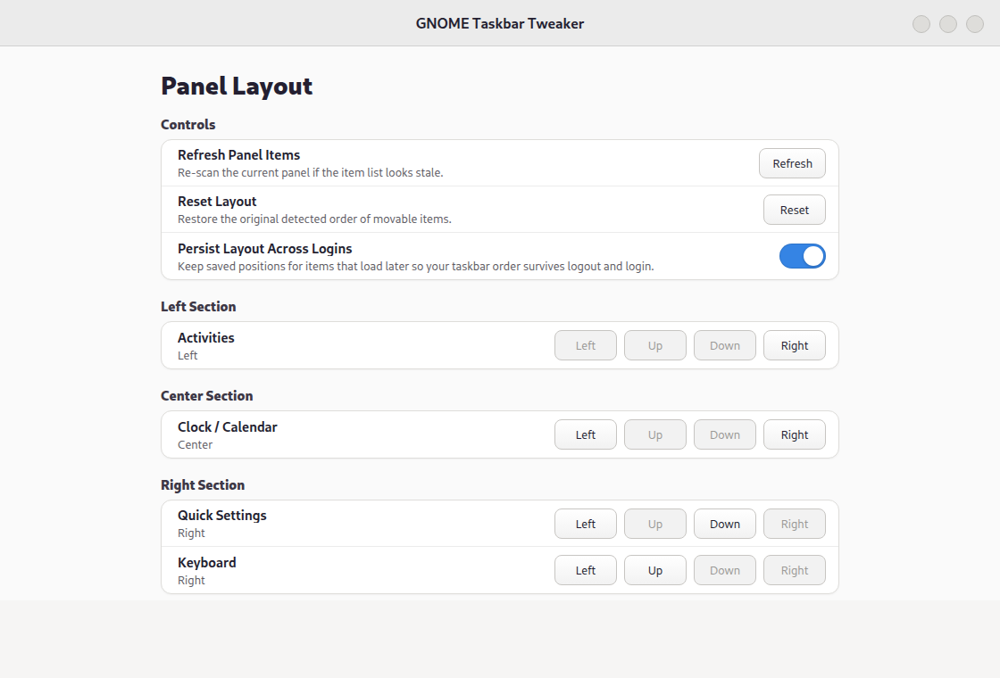

# GNOME Taskbar Tweaker

GNOME Taskbar Tweaker is a GNOME Shell 49/50 extension for reordering supported top-panel items across the left, center, and right sections.

It stays deliberately conservative:

- only items exposed through `Main.panel.statusArea` are movable
- unsupported panel actors are left untouched
- the extension captures a baseline layout so the panel can be reset safely
- disabling the extension leaves the current panel order alone; use Reset before disabling if you want the captured baseline order



## Features

- move supported panel items between left, center, and right
- reorder items within a section
- optionally keep the saved layout across logout/login cycles
- refresh panel discovery after other extensions change
- reset to the detected baseline layout
- compact preferences UI with minimal controls

## Requirements

- GNOME Shell `49` or `50`
- a local GNOME session where `gnome-extensions` and `gsettings` are available
- `glib-compile-schemas`
- `python3`
- `rsync` for source installs
- `node` is optional; `make check` uses it for JavaScript syntax checks when it is installed

## Install from source

```bash
git clone https://github.com/betnbd/gnome-taskbar-tweaker.git
cd gnome-taskbar-tweaker
make check
./scripts/install.sh
gnome-extensions enable "$(python3 -c "import json; print(json.load(open('metadata.json', encoding='utf-8'))['uuid'])")"
./scripts/open-prefs.sh
```

If GNOME Shell does not pick up changes immediately, disable and re-enable the extension or start a fresh session.
If `gnome-extensions info` still shows `OUT OF DATE` right after updating `metadata.json`, log out and back in once so GNOME Shell reloads the cached extension metadata.

## Use

Open the preferences window and use the movement buttons beside each detected item:

- `Left` and `Right` move an item between panel sections.
- `Up` and `Down` reorder an item within its current section.
- `Refresh` asks the running extension to re-scan the current panel.
- `Reset` restores the captured baseline layout.
- `Persist Layout Across Logins` keeps saved positions for indicators that load later in the session.

The extension only moves supported GNOME Shell status-area items. It does not hide panel items, patch unsupported actors, or move application windows.

## Safety and privacy

GNOME Taskbar Tweaker runs locally inside GNOME Shell. It does not make network requests, does not collect telemetry, and does not store credentials.

The extension stores only local GNOME settings for panel layout state:

- `panel-layout`
- `baseline-layout`
- `available-items`
- `persist-layout`
- `layout-version`
- `sync-generation`
- `last-error`

See [SECURITY.md](SECURITY.md) for supported security reporting guidance.

## Troubleshooting

Run these commands from the repository root while logged into the GNOME session:

```bash
./scripts/show-items.sh
./scripts/show-layout.sh
./scripts/show-status.sh
./scripts/logs.sh
```

If the preferences window opens but no movable items appear, click `Refresh` or run:

```bash
./scripts/request-sync.sh
```

If your panel ends up in an unwanted order, run:

```bash
./scripts/reset-layout.sh
```

To fully remove the local source install:

```bash
./scripts/reset-layout.sh
gnome-extensions disable "$(python3 -c "import json; print(json.load(open('metadata.json', encoding='utf-8'))['uuid'])")"
./scripts/uninstall.sh
```

## Development workflow

```bash
make check
./scripts/show-items.sh
./scripts/show-layout.sh
./scripts/show-status.sh
./scripts/smoke-test.sh --install
./scripts/request-sync.sh
./scripts/manual-test.sh
```

## Packaging a release

```bash
./scripts/package.sh
```

This produces:

- `dist/<uuid>.shell-extension.zip`: the raw `gnome-extensions pack` output
- `dist/gnome-taskbar-tweaker-v<version>.zip`: a versioned release artifact

## Repository layout

- `extension.js`: GNOME Shell runtime integration
- `prefs.js`: preferences window
- `layout.js`: shared layout parsing and movement logic
- `schemas/`: GSettings schema
- `scripts/`: install, package, diagnostics, and test helpers
- `CHANGELOG.md`: release notes
- `RELEASING.md`: release checklist

## Publishing notes

Before publishing publicly, review `RELEASING.md`.

In particular:

- confirm the UUID in `metadata.json` matches the public namespace you want to keep long-term
- increment the `version` field in `metadata.json` before packaging a new public build
- confirm the copyright name in `LICENSE` is the one you want to publish
- verify ignored local files stay out of the repository
